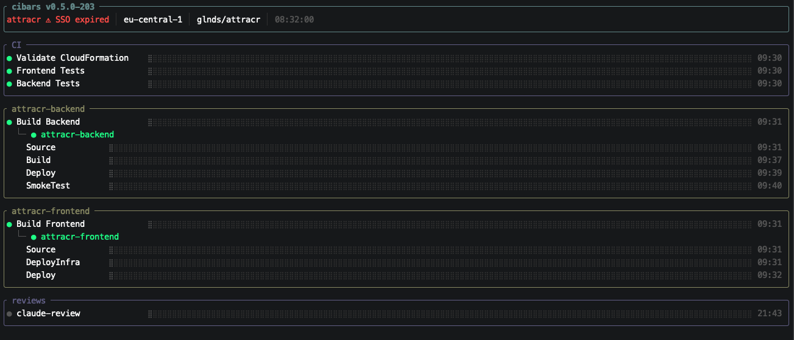

# cibars

A lightweight terminal UI for monitoring CI/CD pipelines, built in Rust.

`cibars` runs as a daemon inside a tmux pane and gives you a live,
consolidated view of your AWS CodePipelines and GitHub Actions in a
single screen -- no browser required.



## Features

### Core Monitoring

- Live polling of AWS CodePipelines and GitHub Actions in a single TUI
- Intelligent polling state machine: Idle (30s) -> LongIdle (5min) ->
  Watching (5s) -> Active (5s) -> Cooldown (5s, 60s timer)
- Auto-discovery of new pipelines and workflow runs (no restart needed)
- Branch filtering for GitHub Actions (`--branch` flag)
- Workflow categorization: CI vs Review (auto-detected via heuristics +
  config override)

### Smart Linkage

- Automatic GH Actions to CodePipeline linkage via S3 source artifact
  matching
- YAML-based and runtime-correlated link discovery
- Pipeline-centric UI layout: jobs grouped under their downstream
  pipeline
- Linkage health monitoring with broken-link warnings
- Manual link re-discovery (`l` key)

### Hook Integration

- Auto-install pre-push hook via `p` (local) or `g` (global) key
- `core.hooksPath` awareness: detects global hooks dir, auto-delegates
  to local hooks
- Per-project PID files for multi-instance signal targeting
- `pushed!` flash feedback when SIGUSR1 received from hook

### AWS SSO Support

- SSO token health monitoring via STS `GetCallerIdentity` during
  LongIdle
- Visual SSO expired indicator in header

### UI

- btop-inspired terminal UI with rounded borders and muted color palette
- Color-coded bars: yellow-to-orange gradient (running), green
  (succeeded), red (failed), grey (idle)
- Braille-character bar fill with gradient animation
- Expand/collapse all sections (`e` key)
- Boost key (`b`) with visual flash feedback
- Status bar with poll state indicator, animated tick counter,
  keybindings, hook status, linkage status, and warnings
- Completion timestamps per bar (HH:MM)

### Operational

- Manual boost via `b` key or SIGUSR1 signal
- Graceful SIGTERM handling for tmux session cleanup
- Per-project PID files (`~/.cibars/pids/`) for reliable signal
  delivery
- Rate limit back-off for GitHub API (60s)
- Structured logging to `~/.cibars/cibars.log` with configurable
  levels via `RUST_LOG`

## Requirements

- Rust 1.78+ (stable toolchain)
- An AWS profile configured via `~/.aws/credentials`,
  `~/.aws/config`, or `AWS_PROFILE` (SSO profiles supported)
- A GitHub token: either `GITHUB_TOKEN` env var or `gh auth token`
  (GitHub CLI auto-fallback)

## Installation

```bash
git clone https://github.com/glnds/cibars
cd cibars
cargo install --path .
```

## Usage

```bash
cibars --aws-profile <profile> --region <region> --github-repo <owner/repo>
```

### Arguments

| Argument | Description | Example |
| --- | --- | --- |
| `--aws-profile` | AWS named profile to use | `staging` |
| `--region` | AWS region | `eu-west-1` |
| `--github-repo` | GitHub repository in `owner/repo` format | `acme/backend` |
| `--branch` | Git branch to filter GitHub Actions runs | `master` |

### Configuration file

Instead of passing CLI flags, create a `config.toml` in the working
directory. CLI args take precedence.

```toml
aws_profile = "staging"
region = "eu-west-1"
github_repo = "acme/backend"
# branch = "master"

# [workflow_categories]
# review = ["Claude Code Review"]
```

Copy `config.toml.example` to get started:

```bash
cp config.toml.example config.toml
```

### Environment variables

| Variable | Required | Description |
| --- | --- | --- |
| `GITHUB_TOKEN` | No* | GitHub PAT, `repo` + `actions:read`. *Falls back to `gh auth token`. |
| `RUST_LOG` | No | Log level for `~/.cibars/cibars.log` (e.g. `info`, `debug`, `trace`) |

## Keybindings

| Key | Action |
| --- | --- |
| `e` | Expand / collapse all sections |
| `b` | Boost: trigger immediate poll (Idle/LongIdle -> Watching) |
| `p` | Install pre-push hook in `.git/hooks/` (local) |
| `g` | Install pre-push hook in global hooks dir (when `core.hooksPath` is set) |
| `l` | Re-discover GH Actions / CodePipeline linkage |
| `q` | Quit |
| `Ctrl+C` | Quit |

## UI Layout

```text
╭─ cibars v0.5.0-123 ──────────────────────────────────────────────────╮
│ staging  │ eu-west-1 │ acme/backend │ 14:32:05                       │
╰───────────────────────────────────────────────────────────────────────╯
╭─ GitHub Actions ──────────────────────────────────────────────────────╮
│ * CI / build      ⣿⣿⣿⣿⣿⣿⣿⣿⣿⣿⣿⣿⣿⣿⣿⣿⣿⣿⣿⣿⣿⣿⣿⣿⣿⣿⣿⣿⣿⣿    14:31 │
│   └ backend-deploy ⣿⣿⣿⣿⣿⣿⣿⣿⣿⣿⣿⣿⣿⣿⣿⣿⣿⣿⣿⣿⣿⣿⣿⣿⣿⣿⣿⣿       14:30 │
│ * CI / test        ⣿⣿⣿⣿⣿⣿⣿⣿⣿⣿⣿⣿⣿⣿⣿⣿⣿⣿⣿⣿⣿⣿⣿⣿                  │
│                                                                       │
│ Review                                                                │
│   Code Review      ⣿⣿⣿⣿⣿⣿⣿⣿⣿⣿⣿⣿⣿⣿⣿⣿⣿⣿⣿⣿                      │
╰───────────────────────────────────────────────────────────────────────╯
╭─ CodePipelines ───────────────────────────────────────────────────────╮
│ infra-pipeline     ⣿⣿⣿⣿⣿⣿⣿⣿⣿⣿⣿⣿⣿⣿⣿⣿⣿⣿⣿⣿⣿⣿⣿⣿⣿⣿⣿⣿⣿⣿⣿  14:28 │
╰───────────────────────────────────────────────────────────────────────╯
╭───────────────────────────────────────────────────────────────────────╮
│ Slow ▮▯▯▯▯ │ e=expand b=boost q=quit │ hook │ l=relink               │
╰───────────────────────────────────────────────────────────────────────╯
```

Bars use braille fill characters with gradient animation. Linked
pipelines indent under their GitHub Action with a `└` connector.

| Color | Hex | Meaning |
| --- | --- | --- |
| Yellow to Orange gradient | `#F0C050` to `#FF9E64` | Build is running |
| Green | `#00FF7F` | Build finished: succeeded |
| Red | `#FF4040` | Build finished: failed |
| Grey | `#555555` | No active or recent build |

## Polling State Machine

cibars uses an intelligent polling strategy to minimize API calls
while staying responsive. AWS CodePipeline depends on GitHub
Actions, so AWS is only polled when GitHub detects running builds.

**Startup:** The first poll cycle always polls both GitHub and AWS
to give immediate visibility into current status.

```text
              boost (b key)
    ┌──────────────────────────┐
    │                          ▼
  Idle ──────────────────► Watching
  30s GH, no AWS           5s GH, no AWS
    ▲         │                │
    │         │ 5min idle      │ GH finds running
    │         ▼                ▼
  LongIdle  Cooldown ◄──── Active
  5min GH   5s GH+AWS      5s GH+AWS
  no AWS    60s timer           │
    │         │                 │ nothing running
    │         └─────────────────┘
    │  boost (b key)
    └──────────────────► Watching
```

| State | GH interval | Poll AWS? | Entry |
| --- | --- | --- | --- |
| Idle | 30s | No | Startup (after initial poll), or cooldown expired |
| LongIdle | 5min | No | 5min of Idle with no running builds |
| Watching | 5s | No | User pressed `b` from Idle or LongIdle |
| Active | 5s | Yes | GitHub detects running builds |
| Cooldown | 5s | Yes | Nothing running (from Active), 60s timer |

**Key transitions:**

- Press `b` or send SIGUSR1 in Idle/LongIdle -> Watching (fast
  GH-only polling)
- 5min of Idle with no running builds -> LongIdle (5min polling)
- GitHub finds running builds -> Active (adds AWS polling)
- All builds finish -> Cooldown (keeps fast polling for 60s)
- 60s of inactivity -> back to Idle
- Pressing `b` in Active/Cooldown is a no-op (already fast)

**Notes:**

- During LongIdle, cibars also polls STS `GetCallerIdentity` to
  monitor AWS SSO session health.
- SIGUSR1 during an active poll cancels the current API call and
  restarts in Watching mode.

## Git Hook Integration

cibars can auto-install a `pre-push` git hook so every `git push`
immediately boosts polling -- no manual `b` press needed.

**How it works:**

1. cibars writes a per-project PID file to `~/.cibars/pids/` on
   startup.
2. Press `p` to install a pre-push hook in `.git/hooks/` (local to
   the repo).
3. Press `g` to install in the global hooks dir (when
   `core.hooksPath` is configured). This includes delegation to
   repo-local hooks so both global and local hooks run.
4. On `git push`, the hook sends SIGUSR1 to the correct cibars
   instance via the PID file.
5. The status bar shows `pushed!` flash for 1.5 seconds.

**Status bar hook indicators:**

- `hook` -- hook is installed and active
- `p=install hook` -- no hook detected, press `p` to install
- `hook:override g=fix` -- local hook is shadowed by
  `core.hooksPath`, press `g` to fix

**Manual SIGUSR1** still works for scripting or other integrations:

```bash
kill -USR1 $(cat ~/.cibars/pids/$(pwd | tr '/' '_').pid 2>/dev/null)
```

## Recommended tmux setup

```bash
tmux new-window -n cibars
tmux send-keys \
  'cibars --aws-profile staging --region eu-west-1 --github-repo acme/backend --branch master' \
  Enter
```

## macOS Tahoe+ code signing

macOS 26 (Tahoe) and later may block adhoc-signed binaries via
AppleSystemPolicy. If `cibars` gets killed by SIGKILL on startup,
re-sign the binary:

```bash
codesign -s - --force ~/.cargo/bin/cibars
```

## License

MIT
